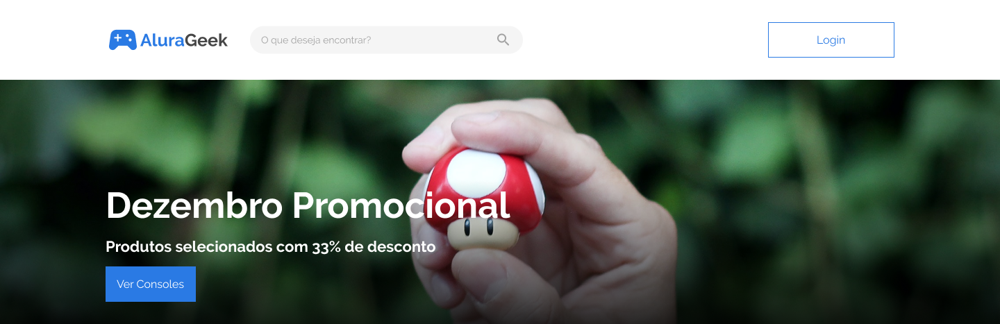
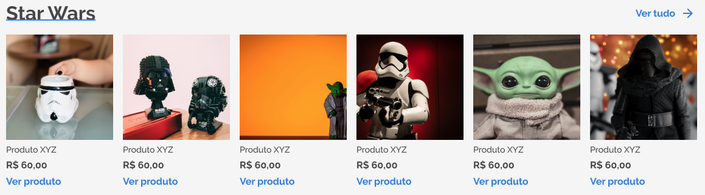

<h1 align="center">
  
  
  

    O e-commerce do mundo geek
  

</h1>

<h2> O que é esse projeto? </h2>

 
  AluraGeek é um e-commerce do mundo geek. Através dele é possível
  criar uma conta e publicar seus produtos. Você pode acessar o projeto
  através desse <a href="https://alura-geek-pink.vercel.app/">link</a>

  

 

  <h2>Ferramentas utilizadas</h2>
  <ul>
    <li>React</li>
    <li>Next.js</li>
    <li>styled components</li>
    <li>supabase</li>
  </ul>

## Autor

